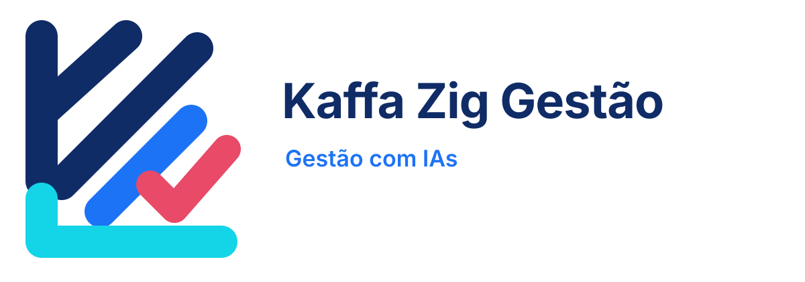
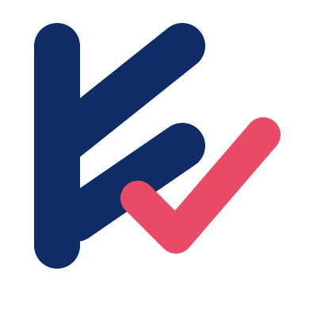

# Manual de marca — Kaffa Zig Gestão

**Versão 1.2 — revisão estética final, agosto de 2026**

## 1. Papel da marca

A **Kaffa Zig Gestão** atua principalmente com **gestão, incluindo gestão de projetos**. A marca também desenvolve soluções digitais e utiliza inteligência artificial como apoio para organizar informações, rotinas, compromissos e ações.

> **Posicionamento:** gestão clara para transformar objetivos em planos, decisões e entregas.

As ferramentas digitais não definem sozinhas a atividade da marca. Elas são meios de apoio à gestão e podem aparecer como produtos, serviços ou recursos complementares.

A comunicação deve ser compreendida por pessoas que não trabalham com tecnologia. Sempre que uma palavra técnica for indispensável, explique seu significado na primeira vez em que aparecer.

## 2. Personalidade

A marca é **organizada, acessível, contemporânea, confiável e prática**. O tom de voz é direto, didático e acolhedor, sem exageros técnicos ou promessas que não possam ser verificadas.

| Preferir | Evitar |
|---|---|
| “Veja o que precisa ser feito hoje.” | “Otimize seu workflow omnichannel.” |
| “Cadastre no app ou no Calendar.” | “Use uma arquitetura de integração multicanal.” |
| “A tarefa volta para a planilha.” | “O pipeline é reconciliado automaticamente.” |
| “Toque em Sync para atualizar.” | “Execute uma operação de refresh assíncrona.” |

## 3. Arquitetura da marca

A marca institucional é **Kaffa Zig Gestão**. Os aplicativos são produtos da marca e podem manter nomes próprios, como **Auditoria Agenda**.

| Nível | Nome | Uso |
|---|---|---|
| Marca institucional | Kaffa Zig Gestão | Manual, documentos, apresentações e comunicação corporativa |
| Linha de produtos | Apps da Kaffa Zig Gestão | Conjunto de aplicativos de gestão |
| Produto | Auditoria Agenda | Organização de eventos e tarefas |
| Assinatura editorial | Criado por Kaffa Zig Gestão com IAs | Rodapé de apresentações, posts e materiais de divulgação |
| Crédito da instalação | Criado por [nome de quem configurou] | Página Sobre de cada instalação do AppSheet |

A assinatura editorial não deve ser confundida com o crédito da instalação. No AppSheet, o crédito deve identificar quem criou e configurou aquela instalação específica.

## 4. Conceito do logo

O símbolo combina um **Z geométrico** com uma confirmação coral integrada. O Z representa organização, direção e avanço; a confirmação coral representa uma decisão ou entrega concluída. A construção foi reduzida a formas sólidas, com proporções controladas e sem linhas decorativas sem função.

A simplicidade é intencional: o símbolo precisa funcionar em ícone, tela pequena, documento e apresentação. O contraste entre azul-marinho e coral cria uma assinatura institucional limpa, sem usar ciano ou azul-claro como destaque.

O símbolo pode ser usado sozinho em ícone de aplicativo, favicon, avatar e espaço reduzido. O logo completo deve ser usado quando houver espaço para o nome institucional.

## 5. Arquivos oficiais

| Arquivo | Uso recomendado |
|---|---|
| `logo_kaffa_zig_gestao_principal.svg` | Logo horizontal vetorial, preferencial para redimensionamento |
| `logo_kaffa_zig_gestao_simbolo.svg` | Símbolo vetorial para ícones e espaços reduzidos |
| `logo_kaffa_zig_gestao_simbolo_branco.svg` | Símbolo vetorial branco para fundos escuros |
| `logo_kaffa_zig_gestao_principal_clean.png` | Logo horizontal PNG com transparência real |
| `logo_kaffa_zig_gestao_simbolo_clean.png` | Símbolo PNG com transparência real |
| `logo_kaffa_zig_gestao_branco_clean.png` | Símbolo PNG branco com transparência real |

O logo principal tem composição horizontal: símbolo à esquerda, nome **Kaffa Zig Gestão** e assinatura **GESTÃO • PROJETOS** abaixo do nome. Não reescreva o nome em outra fonte quando o arquivo oficial estiver disponível.





## 6. Cores

A identidade institucional combina azul-marinho profundo com coral para comunicar organização, decisão e conclusão. Azul elétrico e ciano continuam disponíveis apenas como cores auxiliares de produtos digitais, não como destaque do logo institucional.

| Cor | Código | Uso |
|---|---|---|
| Azul-marinho profundo | `#071426` | Fundo principal de apresentações e capas |
| Azul-marinho institucional | `#0B1F45` | Símbolo, nome e elementos institucionais do logo |
| Azul elétrico | `#1D73F5` | Ações, links, tecnologia e destaque em produtos |
| Ciano | `#13D5E7` | Cor auxiliar de produtos; não usar como destaque no logo institucional |
| Coral | `#E8536C` | Ação, prioridade, chamada e confirmação |
| Branco suave | `#F4F7FB` | Texto principal sobre fundo escuro |
| Cinza azulado | `#A9B7CC` | Texto auxiliar e informações secundárias |

Use no máximo duas cores na marca principal: azul-marinho e coral. O azul-marinho é a cor institucional dominante; o coral sinaliza ação, prioridade ou conclusão. **O ciano/azul-claro não faz parte do logo institucional novo** e não deve aparecer como elemento de destaque nessa marca. Ele pode ser usado somente como cor auxiliar em materiais específicos de produtos, quando necessário.

## 7. Tipografia

A recomendação é usar uma sans-serif geométrica e legível:

| Função | Fonte recomendada | Peso |
|---|---|---:|
| Títulos | Sora | 700 ou 800 |
| Subtítulos | Sora | 600 |
| Texto corrido | Inter | 400 ou 500 |
| Botões e rótulos | Inter | 600 |

Quando essas fontes não estiverem disponíveis, use Arial ou outra sans-serif limpa. Evite fontes manuscritas, excesso de caixa alta e títulos muito longos.

## 8. Regras do logo

### Área de proteção

Mantenha ao redor do logo uma área livre equivalente à altura do traço inferior do símbolo. Nenhum texto, botão, borda ou imagem deve invadir esse espaço.

### Tamanho mínimo

| Versão | Tamanho mínimo recomendado |
|---|---:|
| Logo horizontal em tela | 240 px de largura |
| Logo horizontal em impressão | 55 mm de largura |
| Símbolo quadrado em tela | 32 px |
| Símbolo quadrado em impressão | 10 mm |

Abaixo desses tamanhos, use apenas o símbolo. Nunca reduza o logo até tornar o nome ilegível.

### Contraste

Use o logo colorido sobre fundo branco ou muito claro e a versão branca sobre azul-marinho ou outra superfície escura. Não coloque o logo sobre fotografia muito detalhada sem uma área de proteção visual.

### Não fazer

Não estique, comprima, incline, contorne, aplique sombra, troque as cores, altere a proporção, remova partes do símbolo ou acrescente textos ao arquivo oficial. Não use o logo para sugerir que o GitHub, o Google ou o AppSheet são marcas da Kaffa Zig Gestão.

## 9. Aplicação nos aplicativos

Para um app da linha Kaffa Zig Gestão:

- use o símbolo quadrado como ícone quando o espaço for pequeno;
- use o logo horizontal na página Sobre, nos materiais de apresentação e em imagens de divulgação;
- mantenha o nome do produto em destaque, por exemplo, **Auditoria Agenda**;
- use o rodapé `Criado por Kaffa Zig Gestão com IAs` em apresentações e posts;
- na página Sobre de cada instalação, informe o crédito real de quem configurou o app;
- não use a conta Google de origem como se fosse crédito institucional.

## 10. Aplicação na Auditoria Agenda

A Auditoria Agenda é um produto da Kaffa Zig Gestão. Seu símbolo específico pode continuar usando calendário e checklist, enquanto o logo institucional identifica a empresa criadora.

Uma composição recomendada para capa é:

```text
[ícone Auditoria Agenda]  Auditoria Agenda
                           Organização para agir

[logo Kaffa Zig Gestão]
Criado por Kaffa Zig Gestão com IAs
```

O produto pode manter a identidade azul-marinho, azul elétrico, coral e ciano usada nos materiais da Auditoria Agenda, mas o logo institucional novo usa somente azul-marinho institucional e coral. Marca institucional e marca de produto devem ser reconhecíveis sem competir entre si.

## 11. Comunicação para gestão de projetos

Explique sempre o benefício antes do funcionamento. Exemplos:

- “Cadastre uma reunião no Calendar ou uma ação no Tasks.”
- “Veja tarefas pendentes e concluídas em listas separadas.”
- “Altere pelo app e acompanhe a atualização na fonte Google.”
- “Use o Sync no celular para carregar a versão mais recente.”

A diferenciação básica deve ser apresentada assim:

| Registro | Pergunta que responde |
|---|---|
| Evento | “Quando preciso estar disponível?” |
| Tarefa | “O que preciso fazer?” |

Para detalhes e exemplos, consulte [`GUIA_DIFERENCIAR_EVENTO_TAREFA.md`](GUIA_DIFERENCIAR_EVENTO_TAREFA.md).

## 12. Acessibilidade e segurança

Mantenha contraste forte entre texto e fundo, use frases curtas e não dependa somente da cor para diferenciar status. Para tarefas, escreva também `Pendente` ou `Concluída`; para eventos, mostre a data e o horário.

No plano gratuito do AppSheet usado neste projeto, não é possível exigir login obrigatório dentro do aplicativo. Portanto, compartilhe o app apenas com pessoas de confiança, mantenha a planilha com acesso restrito e não insira senhas, tokens, documentos pessoais, dados financeiros ou outras informações confidenciais.

## 13. Checklist antes de publicar

| Verificação | Pergunta |
|---|---|
| Logo | O arquivo está proporcional e legível? |
| Cores | O azul-marinho domina e os acentos estão sendo usados com moderação? |
| Texto | Uma pessoa fora da área de tecnologia entenderá a mensagem? |
| Produto | Está claro se o exemplo é evento, tarefa ou os dois? |
| Crédito | A assinatura editorial e o crédito da instalação estão corretos? |
| Segurança | Há algum dado pessoal, senha ou token visível? |
| App | O link e o nome do produto estão corretos? |

## 14. Ativos relacionados

- `logo_kaffa_zig_gestao_principal.svg`
- `logo_kaffa_zig_gestao_simbolo.svg`
- `logo_kaffa_zig_gestao_simbolo_branco.svg`
- `logo_kaffa_zig_gestao_principal_clean.png`
- `logo_kaffa_zig_gestao_simbolo_clean.png`
- `logo_kaffa_zig_gestao_branco_clean.png`
- `GUIA_DIFERENCIAR_EVENTO_TAREFA.md`
- `APRESENTACAO_LINKEDIN_DIDATICA.md`

